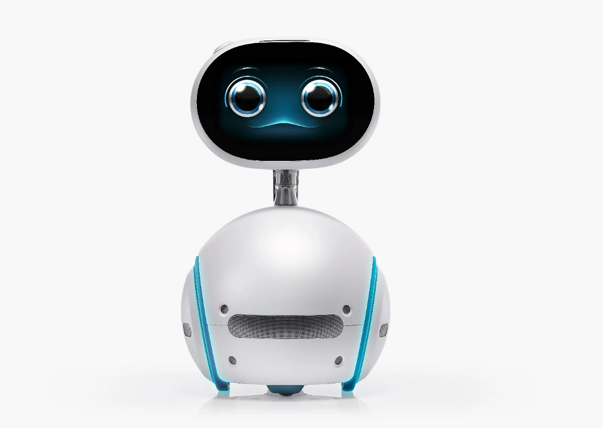

import Zensafetyvid from '@site/static/Zenbo_demo.mp4'

# Zensafety
## **Table of Contents:**
- Overview
- App Demonstration Video
- What I did

## Overview
Meet **Zenbo**,  a new robot friend for seniors, kids, and anybody else who wants to invite a real-world version of BB-8 into their own home. **Zenbo**, **Zenbo Junior** are humanoid robots (with wheels attached), made by **ASUS**.

It has the ability to talk, move around, and act as a robot friend to kids and seniors.

**Zensafety** is an application made to work on **Zenbo**, which can help users secure their most prized possessions. Users can select out of a list of 90 objects to track, and **Zensafety** can keep track of the security status of each and every one of those objects using its object detection technology. 

Opening Zenbo’s camera feature, users can see what zenbo’s camera is seeing, along with customised coloured rectangles labeling the positions and confidence level (which is: how sure Zenbo is of the object detection) of each detected object in the frame, updated every 200-300ms. 

A security rating from 1-10 will be given to each selected object based on the amount of the selected object detected and the confidence level for each object detection. If any object is found to not be secured(no detection or less than 60% confidence), the user will be notified. Additionally, the statuses of each tracked object will be written into text documents saved locally that can be accessed by the user through **Zensafety**.

**Zensafety** utilises plenty of Zenbo’s in-built features, such as voice-control, allowing Zenbo to directly communicate with users through system-initiative dialogue and build a good interaction experience. Additionally, **Zensafety** demonstrates multimodalily and displays emotions, such as smiling, when first welcoming users to use **Zensafety**, or loving and shyness when being tapped on the head, which helps it act as a companion to the users.

## Zensafety Demonstration Video
<video width="100%" height="100%" controls muted>
     <source src={Zensafetyvid}/>
</video>

## What I did
This project was independently designed and developed by me as part of a yearlong course provided by the *HK Academy for Gifted Education*. I was guided by Dr. Wendy Hui of Lingnan University throughout the length of the project. 

