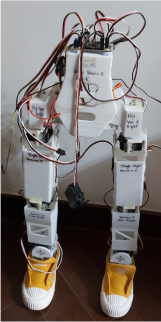

import ReactPlayer from 'react-player'
import Anodroidpic from '@site/static/Anodroid_demo.mp4';

# Anodroid

**Table of Contents:**
- Overview
- Example Pictures of Robot
- My contributions

### Overview
**Anodroid** is a 12-DOF humanoid-robot of height 54cm(22 inch). It is an integrated machine that can move around in flat and tilted surfaces. 

### Exemplar Pictures of the Robot

<video width="100%" height="100%" controls muted>
     <source src={Anodroidpic}/>
</video>

### My Contributions
This project was independently designed and built by me as part of a personal project. During the development of *Anodroid*, much inspiration was derived from the [Poppy project](https://www.poppy-project.org/en/). 

