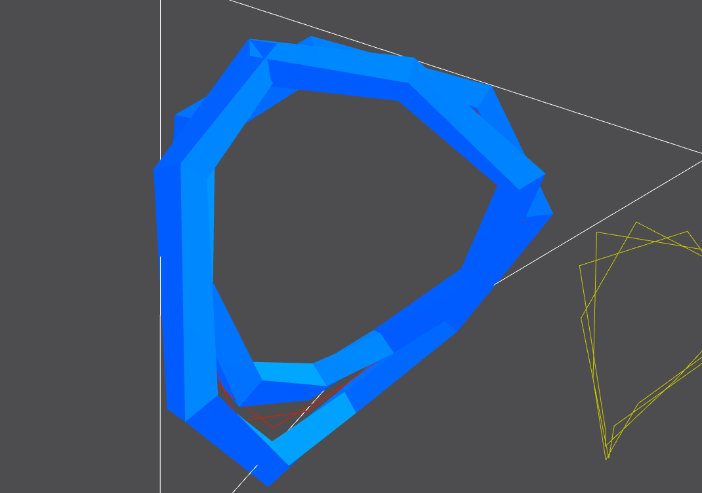
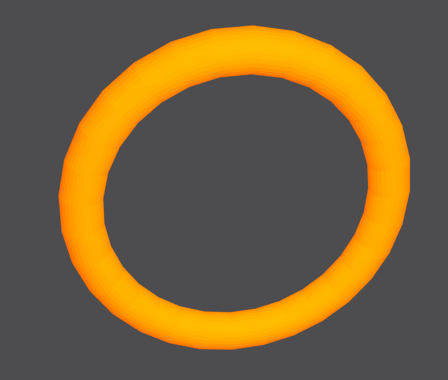
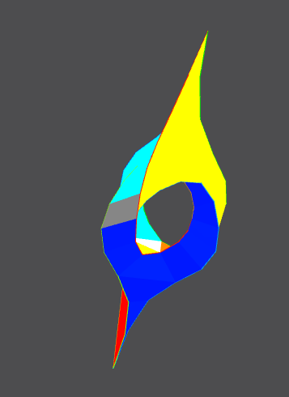
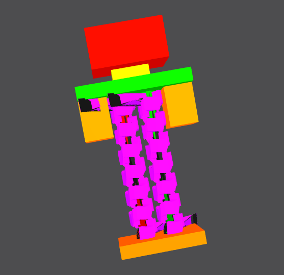

# JIPCAD - Joint Interactive Procedural Computer Aided Design
### UGIS 192D, Fall 2022
## Aaron Zheng 

**Table of Contents:**
- Overview
- Example Photos
- My contributions
	- Development of New VSCode Extension
	- Identifying bugs and issues
- What I learnt

## Overview
**JIPCAD (Joint Interactive Procedural Computer-Aided Design)** is a new computer-aided design software tool that supports both procedural and interactive modeling. Procedural modeling allows users to use NOME, JIPCAD's proprietary programming language to sketch 3D models. On the other hand, users can also use the user interface to model 3D objects, such as by adding new faces and polylines through the interactive program. 

**JIPCAD** is a design tool that came to being from the **JIPCAD project**, a project initiated and developed by ==Professor Carlo Sequin== and his team of researchers at UC Berkeley. **JIPCAD** is specifically built for the modeling of 2-manifold free-form surfaces of high complexity and inherent regularity, like the [Mobius Strip](https://brilliant.org/wiki/mobius-strips/), or sculptures by artists such as [Eva Hild](https://www.evahild.com/ceramics) or [Charles O. Perry](http://www.charlesperry.com/).
## Example photos of modeling using JIPCAD

## My Contributions
### Backend support for the NOME Language
During my time as a researcher for the JIPCAD project, I was able to develop the first version (**0.0.0**) of a [VSCode extension](https://marketplace.visualstudio.com/items?itemName=AaronZheng.nome) for the proprietary NOME JIPCAD language. The features that I managed to include were the following:

- ***Autocompletion of commands***

I was able to implement autocompletion features for codeblocks, so that once codeblocks are typed into a code window, the corresponding closing codeblock will appear automatically.  

- ***Syntax coloring***

I was also able to implement *syntax-coloring*, specifically the colouring of **variables**, **commands**, **comments**, and **parameters**. This allows for a more user-friendly interface, as developers using the NOME language can now know what each section of their code represents. 

- ***Commenting***

The NOME JIPCAD extension also has the ability of toggling block comments. In addition, with the extension, commenting using the corresponding opening/closing pair `(*` and `*)` is enabled for all files with the `.nom, .jipcad` suffix.

- ***Running of Nome Executable***

As demonstrated above, the NOME extension allows developers to run the NOME executable without having to use file explorer or navigate directories terminal. Instead, the extensino includes a custom command on VSCode, which allows the NOME executable to be opened and executed. 

- ***Customize directory of NOME executable***

Tying back to previous functionality, the NOME VSCode extension allows developers to input a *customised path* of the NOME executable. The default path is the JIPCAD directory located as a subdirectory of the HOME directory. 

In the future, I plan to include more advanced features, such as:
- **Semantic highlighting**
- **Syntax error reporting**

I believe these features will significantly improve the experience of developers of the NOME proprietary language, as it will greatly simplify their experience in programming with NOME. 
### Identifying bugs and issues with the JIPCAD software
While sketching some designs, I was able to identify some issues in relation to the JIPCAD software. I discovered this whilst trying to sketch a robot using the software.
#### My robot sketch

**JIPCAD** is able to merge models together. Merging is essential as merging allows the `.nom, .jipcad` design file to be converted into a format compatible with `3D-printing. ` But my design above was not able to be merged. The reason was the inability of JIPCAD to merge two sweeps that share the same face (specifically, the robot's shoulder(*green*) and the robot's two arms(*yellow*)). 

Although I have discovered the bug, unfortunately I have yet to be able to fix it. 

### What I learnt
During the research apprenticeship, I learnt a lot about the NOME proprietary programming language, and how to use it to sketch points, rotated shapes and more. I also obtained a more in-depth understanding of compilers, base-level programming languages like antlr4, regular expressions, using VSCode datasheets like `.json` files, and how to write a grammar for a new programming language. 
